# 付款申請單＋請款 · 操作手冊

**專案目的：** 協助團隊掌握璽墨與 ACC 之間標案同步、付款申請核銷及標案請款入帳的完整操作流程。

本手冊分三塊：

1. **璽墨及 ACC 介面同步說明**（說明 1～2）
2. **付款申請單流程**（步驟 1～5）
3. **標案請款流程**（步驟 1～9）

---

# 一、璽墨及 ACC 介面同步說明

## 說明 1

| 說明 |
| --- |
| 在璽墨的介面新增標案後，ACC 的介面就會同步出現該標案 |

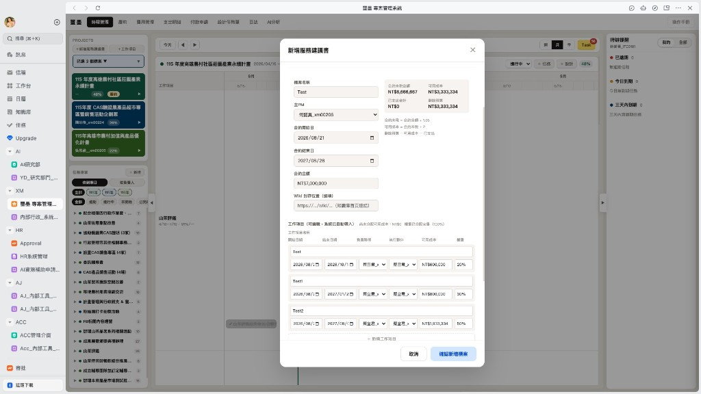

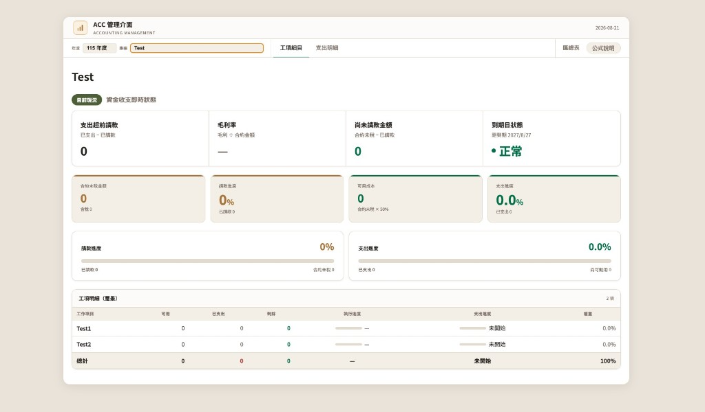

---

## 說明 2

| 說明 |
| --- |
| 璽墨的任務進度％數會同步顯示在 ACC 的工項列表 |

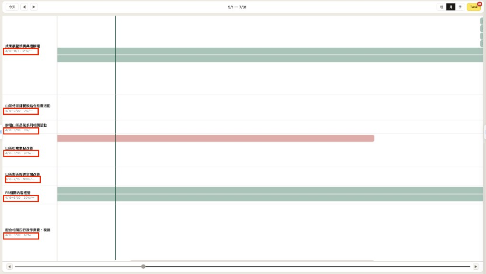

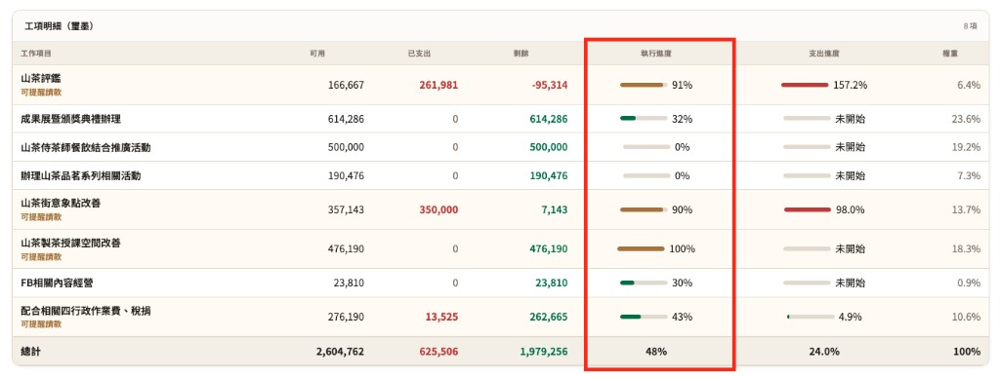

---

# 二、付款申請單流程

## 步驟 1

| 說明 |
| --- |
| 填寫付款申請單 |

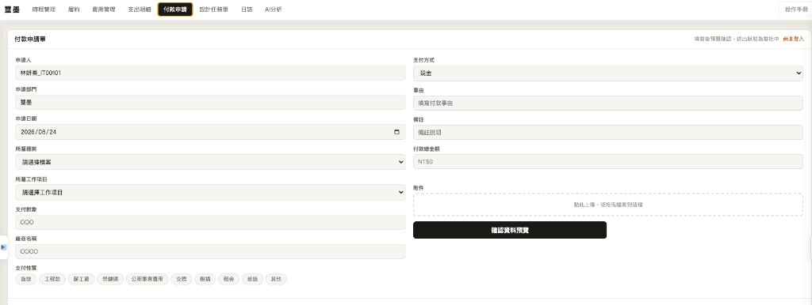

---

## 步驟 2

| 說明 |
| --- |
| 填寫完畢的付款申請單會出現在下方的「已送出的付款申請」 |

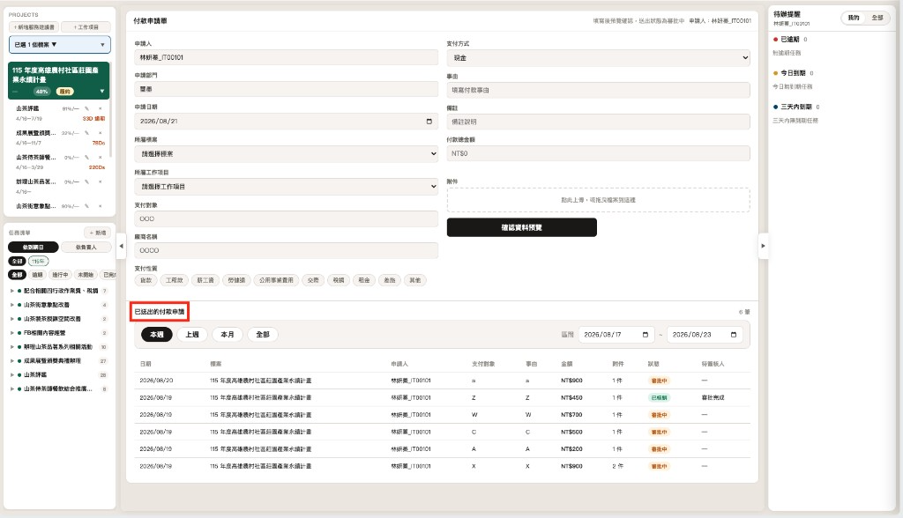

---

## 步驟 3

| 說明 |
| --- |
| 點擊審批進入審核中心，可以看到此付款申請單的細項以及要簽核的人，簽核到最後一個人即結束 |

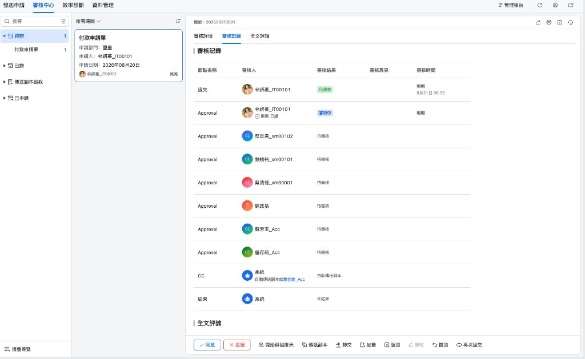

---

## 步驟 4

| 說明 |
| --- |
| 當此審批已經通過的時候，「已送出的付款申請」的狀態就會顯示「已核銷」，並出現在璽墨的支出明細頁面內及費用管理頁面 |

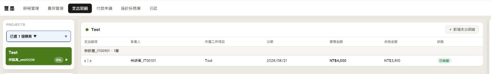

---

## 步驟 5

| 說明 |
| --- |
| 當此審批「已核銷」時，就會出現在 ACC 的管理介面 |

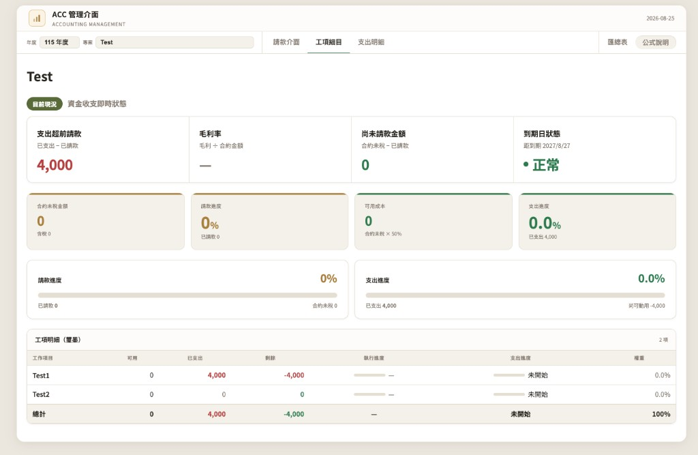

---

# 三、標案請款流程

## 步驟 1

| 說明 |
| --- |
| 打開璽墨專案介面並選擇履約頁面後點擊新增請款，填寫資訊後儲存 |

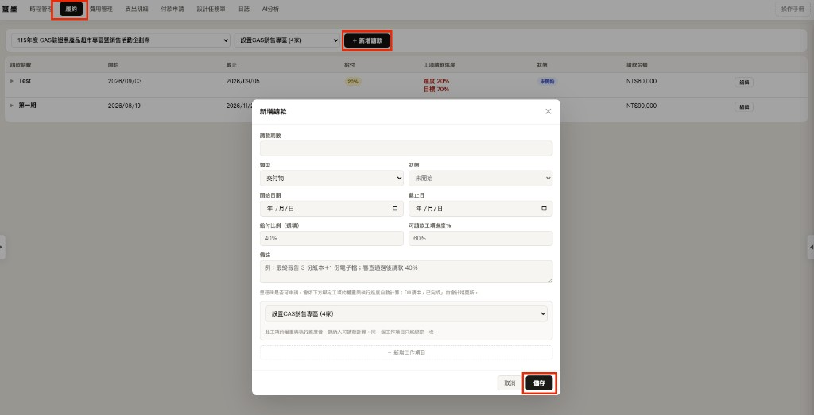

---

## 步驟 2

| 說明 |
| --- |
| 進度達標為綠色且狀態為可申請，並由 Lark 通知主 PM；進度未達標為紅色且狀態為未開始 |

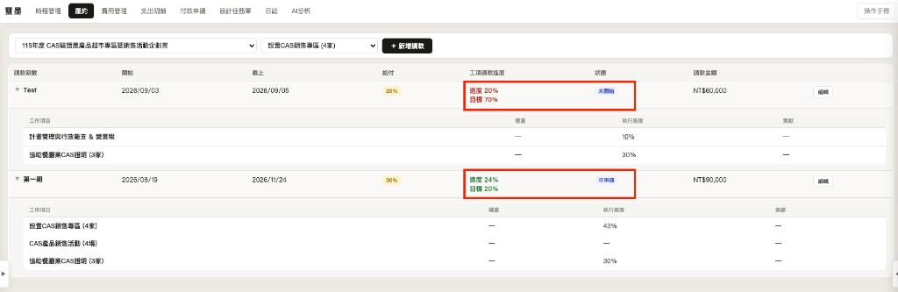

---

## 步驟 3

（此步驟非系統操作）

| 說明 |
| --- |
| 收到 Lark 可申請通知後手開發票並傳 LINE 給會計 |

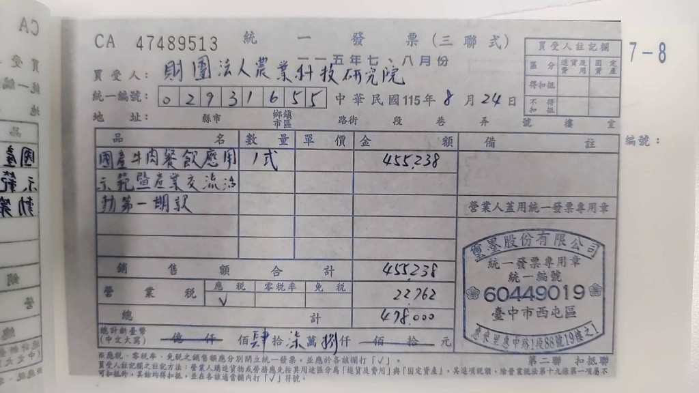

---

## 步驟 4

| 說明 |
| --- |
| 送出此請款時，請到璽墨履約頁面點擊「改申請中」；狀態會同步到 ACC |

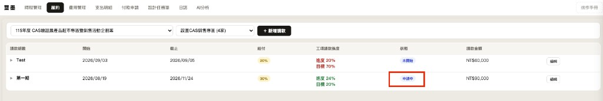

---

## 步驟 5

| 說明 |
| --- |
| ACC 請款介面同步顯示為「申請中」 |

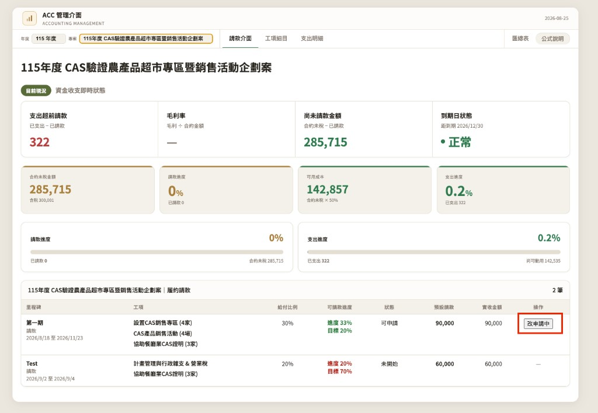

---

## 步驟 6

| 說明 |
| --- |
| 會計確認入帳後請到 ACC 介面點擊「完成入帳」（金額可手動更改） |

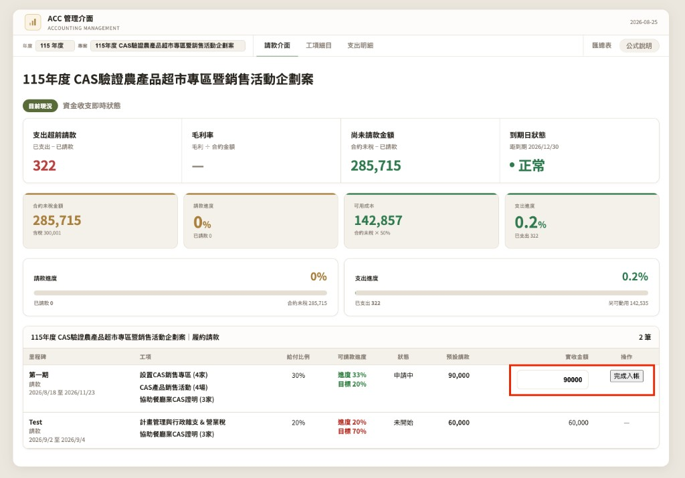

---

## 步驟 7

| 說明 |
| --- |
| 入帳完成後即刻顯示在 ACC 介面上 |

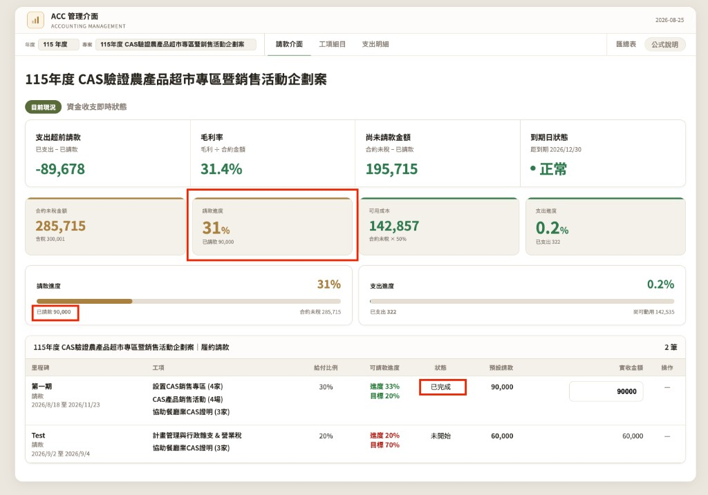

---

## 步驟 8

| 說明 |
| --- |
| 入帳完成後璽墨履約請款狀態為「已完成」 |

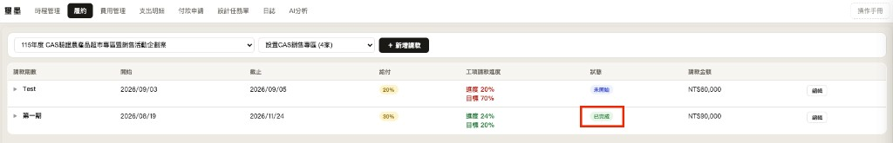

---

## 步驟 9

| 說明 |
| --- |
| 入帳完成後璽墨費用管理同步此專案的入帳金額 |

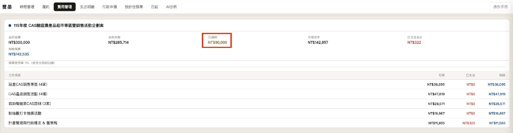
